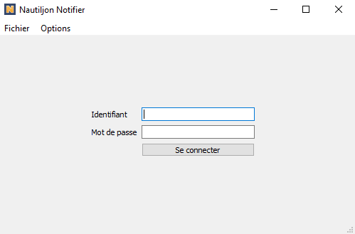
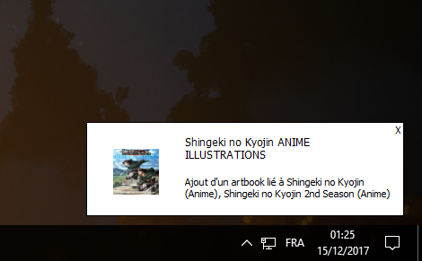

# Nautiljon-Notifier
Receive desktop notifications from nautiljon.com website


<div align="center">
  
  
</div>

## Installing dependencies
This tutorial assumes that you have `Python 3` installed, and pip properly configured.
```
# pip or pip3, depending on your configuration
pip install -r requirements.txt
pip3 install -r requirements.txt
```

## Running the app

```
# Run release
python -O app/app.py

# Run debug
python app/app.py
```

## Building the app

All the plateforms share a command to build the application :

```
rm -rf dist build
python -O -m PyInstaller scripts/build.spec
```

This will fetch all the python dependencies and put them into the `dist` directory. However, you may want a .dmg for MacOS, and a clean installer for Windows. Thus, you will have to follow specific steps for each platform.

### Building on Linux

After running the first command, a binary has been created in the `dist` directory.

### Building on MacOS

To create a .dmg file from the `dist` build, call:

```
rm -f nautiljon_notifier.dmg
hdiutil create -srcfolder dist/nautiljon_notifier.app nautiljon_notifier.dmg
```

### Building on Windows

To build a Windows installer, you first need to download [InnoSetup](http://www.jrsoftware.org/isdl.php).
Once downloaded, you have to add your InnoSetup directory (`Inno Setup 5`) into your `PATH` environment variable in order to use the `ISCC.exe` executable from the app directory.

Then, just call:
```
iscc scripts\build.iss
```
